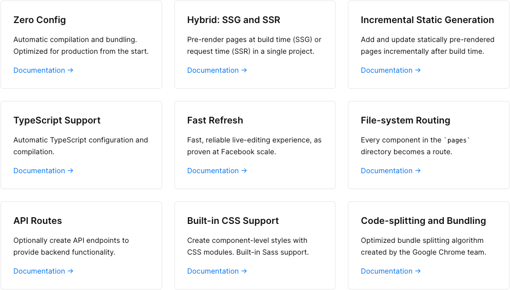

# Next.js

## The React Framework for Production

## 특징 장점

 

### 파일 시스템 라우팅

- Next.js 에서, 페이지는 'pages' 디렉토리의 파일로 부터 export 된 React 컴포넌트 입니다.

- 페이지들은 파일 이름에 기초해 라우트와 연관되어 있습니다.

- 파일명 대,소문자 구분 및 여러 가지가 파일 이름에 관련되어있습니다.

- export default 만 하면 되고 컴포넌트 함수명은 아무런 관계가 없습니다.

 

### Link 컴포넌트

- React-router-dom || Vue Router 처럼 Next.js 파일 시스템 라우팅이 아닌 클라이언트 사이드 네비게이션 라우팅을 제공 하는 next.js 컴포넌트

 

### Router 컴포넌트

- Next.js 에서는 기존의 React-router-dom 에서 사용하는 것처럼 useRouter 훅이 존재한다.
- 그리고 그 훅을 호출하여 받은 객체로 기존의 React 에서 하는것처럼 router 사용이 가능하다.

### 코드 스플리팅 && 프리패칭

- Next.js 는 자동으로 코드 스플리팅을 합니다.
- 각 페이지는 오직 그 페이제 필요한 것들만을 불러옵니다.
- 이는 페이지가 렌더링 괼때, 다른페이지들을 위한 코드들을 처음에 같이 로드 하지 않습니다.
   

- 오직 요청한 페이지의 코드만을 로딩한다는 것은 그 페이지가 고립되었음을 의미하고, 만약 특정 페이지에서 에러가 발생해도, 다른 나머지 페이지들은 여전히 작동할 것입니다.
- 페이지가 로드 가 된뒤 에 next.js 는 prefetching을 하여 해당 컴포넌트에 잇는 Link컴포넌트의 코드들을 프리패칭하여 저장한다.
- 그래서 해당 페이지로 이동할때 prefetching된 코드를 사용하여 빠른 로딩이 가능하다.

### API 라우팅

- pages 폴더에 보면 api 라고 되어있는 hello.js 가 있을것이다.
- Next.js 는 서버의 역활도 할수있기 때문에 내부 api 서버를 커스텀 하여 사용할수있다.
- 서버리스 함수로도 배포 될수있다.
- 서버쪽 번들로 클라이언트쪽 번들의 사이즈에 영향을 주지 않는다.
