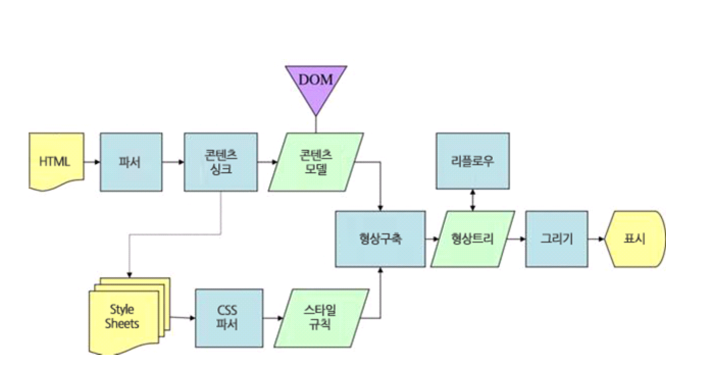
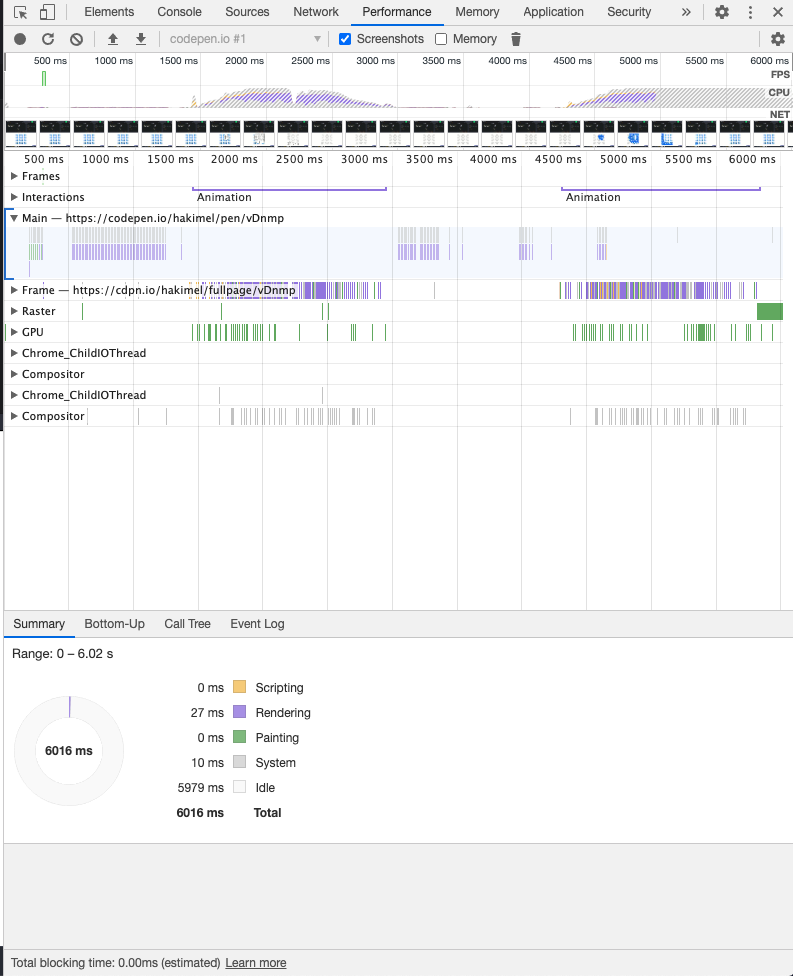

## Reflow & Repaint

- Reflow , Repaint은 렌더링과 관련이 되어있다.
- 그래서 먼저 렌더링 을 알아보고 Reflow, Repaint 를 알아보자 또, 성능 최적화를 위한 작업을 알아보겠다.

<br/>

### 렌더링

- 렌더링이란 서버로부터 HTML 파일을 받아 브라우저에 뿌려주는 과정이다.
  <br/>

### 렌더링 순서


1. HTML 문서를 파싱해서 DOM(Document Object Model) 트리를 만든다.

2. 외부 css 파일과 스타일 요소를 파싱하여 CSSOM(CSS Object Model) 트리를 만든다.

3. DOM 트리와 CSSOM을 결합하여 렌더링 트리를 형성한다.

4. 렌더링 트리에서 레이아웃을 실행하여 각 노드의 기하학적 형태를 계산합니다.

5. 페이지를 보여준다.

<br/>

#### 렌더링 순서에서의 DOM 트리 & CSSOM & 렌더 트리 란??

- DOM 트리 : html 을 파싱하여 나온 element 틀

- CSSOM : 그 각 노드들의 css 모델

- 렌더 트리 : DOM 트리 와 CSSOM 을 합친것

<br/>

### 대표 레이아웃 엔진인 웹킷 & 게코 렌더링 순서를 간단히 알아보자

- 웹킷 (크롬, 오페라, 스윙, 웨일)
  

<br/>

- 게코 (파이어폭스)
  

- 위에 웹킷 및 게코 브라우저 에서 어테치먼트 & 형상구축 후에 렌더트리 & 형상트리 부터가 리 플로우 리페인트 과정이다.
- 그러면 Reflow 와 Repaint 를 알아보자

<br/>

### Reflow

- 생성된 DOM 노드의 레이아웃 수치(너비, 높이, 위치 등) 변경 시 영향 받은 모든 노드의(자신, 자식, 부모, 조상(결국 모든 노드) ) 수치를 다시 계산하여(Recalculate), 렌더 트리를 재생성하는 과정이며 또한, Reflow 과정이 끝난 후 재 생성된 렌더 트리를 다시 그리게 되는데 이 과정을 Repaint 라 합니다.

- 문서 내 노드들의 레이아웃, 포지션을 재계산 후 다시 뿌려주므로 Repaint보다도 더 심각한 퍼포먼스 저하를 유발시키는 프로세스입니다.

- 특정 엘리먼트에 대한 Reflow 발생 시, 페이지에서의 해당 요소는 즉시 Reflow State가 되며 해당 엘리먼트의 자식요소와 부모/조상 요소 역시 레이아웃 계산을 진행합니다. (결국은 페이지 전체를 다시 훑는 것이나 마찬가지)

- 모든 엘리먼트의 위치와 길이 등을 다시 계산하는 것으로 문서의 일부 혹은 전체를 다시 렌더링합니다. 단일 엘리먼트 하나를 변경해도, 하위 엘리먼트나 상위 엘리먼트 등에 영향을 미칠 수 있습니다.

- 어떠한 액션이나 이벤트에 따라 html 요소의 크기나 위치등 레이아웃 수치를 수정하면 그에 영향을 받는 자식 노드나 부모 노드들을 포함하여 Layout 과정을 다시 수행하게 됩니다. 이렇게 되면 Render Tree와 각 요소들의 크기와 위치를 다시 계산하게 됩니다. 이러한 과정을 Reflow라고 합니다.

<br/>

### Repaint

- Reflow 과정이 끝난 후 재 생성된 렌더 트리를 다시 그리게 되는데 이 과정을 Repaint 라 합니다.

- 엘리먼트의 스킨에 변화가 발생하지만, 레이아웃에는 영향을 미치지 않을 때 유발됩니다. (visibility, outline, background-color 등이 포함) Opera에 따르면 Repaint는 해당 행위가 발생하는 순간, 문서내 DOM tree의 다른 노드들의 스킨까지도 검증해야 하므로 비용이 높다고 합니다.

- 레이아웃에는 영향을 주지 않지만, 가시성에는 영향을 주는 엘리먼트가 변경되면 발생합니다. 예를 들면, opacity, background-color, visibility, outline 오페라에 따르면, “브라우저가 DOM 트리에 있는 다른 모든 노드의 가시성을 확인해야 하므로 리페인트는 비용이 많이 든다”고 합니다.

- Reflow만 수행되면 실제 화면에 반영되지 않습니다. Render Tree를 다시 화면에 그려주는 과정이 필요합니다. 결국은 Paint 단계가 다시 수행되는 것이며 이를 Repaint 라고 합니다.

<br/>

### 그러면 Reflow & Repaint 가 언제 호출되나??

##### Reflow

- DOM 엘리먼트 추가, 제거 또는 변경
- CSS 스타일 추가, 제거 또는 변경
- CSS 스타일을 직접 변경하거나, 클래스를 추가함으로써 레이아웃이 변경될 수 있다. 엘리먼트의 길이를 변경하면, DOM 트리에 있는 다른 노드에 영향을 줄 수 있다.
- CSS3 애니메이션과 트랜지션. 애니메이션의 모든 프레임에서 리플로우가 발생한다.
- offsetWidth 와 offsetHeight 의 사용. offsetWidth 와 offsetHeight 속성을 읽으면, 초기 리플로우가 트리거되어 수치가 계산된다.
- 유저 행동. 유저 인터랙션으로 발생하는 hover 효과, 필트에 텍스트 입력, 창 크기 조정, 글꼴 크기 변경, 스타일시트 또는 글꼴 전환등을 활성화하여 리플로우를 트리거할 수 있다.

##### Repaint

- 가시성이 변경되는순간 (opacity, background-color, visibility, outline)
- Reflow 가 호출된 순간 뒤에 호출된다.

##### Code 로 Reflow 와 Repaint를 구분해보자.

```
var bodyStyle = document.body.style;

bodyStyle.padding = "20px"; // Reflow, Repaint
bodyStyle.border = "10px solid red"; // Reflow, Repaint

bodyStyle.color = "blue"; // Repaint
bstyle.backgroundColor = "#cc0000"; // Repaint

bodyStyle.fontSize = "2em"; // Reflow, Repaint

document.body.appendChild(document.createTextNode('Hello!')); // Reflow, Repaint
```

<br/>

### Reflow 를 최소화 하여 성능저하를 막아보자

1. **클래스 변경을 통해 스타일을 변경할 경우, 최대한 말단의 노드의 클래스를 변경한다.**

- 최대한 말단에 있는 노드를 변경함으로써, 리플로우의 영향을 최소화한다.
  <br/>

2. **인라인 스타일을 사용하지 않는다.**

- 스타일 속성을 통해 스타일을 설정하면, 리플로우가 발생한다.
- 엘리먼트의 클래스가 변경될 때 엘리먼트는 하나의 리플로우만 발생시킨다.
- 인라인 스타일은 HTML 이 다운로드될 때, 레이아웃에 영향을 미치면서 추가 리플로우를 발생시킨다.
  <br/>

3. **애니메이션이 들어간 엘리먼트는 position: fixed 또는 position: absolute 로 지정한다.**

- absolute 또는 fixed 위치인 엘리먼트는 다른 엘리먼트의 레이아웃에 영향을 미치지 않는다. (리플로우가 아닌 리페인트가 발생하는데, 이것은 훨씬 적은 비용이 든다.)
  <br/>

4. **부드러운 애니메이션이 성능을 저하시킨다.**

- 한 번에 1px 씩 엘리먼트를 이동하면 부드러워 보이지만, 성능이 떨어지는 디바이스는 말썽일 수 있다.
- 엘리먼트를 한 프레임당 4px 씩 이동하면 덜 부드럽게 보이겠지만, 리플로우 처리의 1/4만 필요하다.
  <br/>

5. **레이아웃을 위한 table 은 피한다.**

- table 은 점진적으로 렌더링되지 않고, 모두 불려지고 계산된 다음에서야 렌더링이 된다. 또한, 작은 변경만으로도 테이블의 다른 모든 노드에 대한 리플로우가 발생한다.
- 레이아웃 용도가 아닌 데이터 표시 용도의 table 을 사용하더라고, table-layout: fixed 속성을 주는 것이 좋다. table-layout: fixed 를 사용하면, 열 너비가 머리글 행 내용을 기반으로 계산되기 때문이다.
  <br/>

6. **CSS 에서 Java Script 표현식을 사용하지 않는다.**

- IE 와 FF 는 모두 CSS 에서 Java Script 를 실행할 수 있다. IE 에서는 표현 기법과 HTC 동작 방법이 있고, FF 에서는 XBL 을 사용하는 방법이 있다. (이 방법은 CSS 에서 Java Script 를 직접 실행하지는 않지만, 그 효과는 동일하다.)
- 문서가 리플로우될 때마다 Java Script 표현식이 다시 계산된다.
  <br/>

7. **CSS 하위 셀렉터를 최소화한다.**

- 사용하는 규칙이 적을수록 리플로우가 빠르다.
- gulp-uncss, grunt-uncss 와 같은 도구로 스타일 정의 및 파일 크기를 줄인다.
  <br/>

8. **숨겨진 엘리먼트를 변경한다.**

- display: none; 으로 숨겨진 엘리먼트는 변경될 때, 리페인트나 리플로우를 일으키지 않는다.
- 그렇기 때문에 엘리먼트를 표시하기 전에 엘리먼트를 변경한다.
  <br/>

9. **Java Script 를 통해 스타일을 변경할 경우, .cssText 를 사용하거나, 클래스를 변경한다.**

```
var el = document.getElementById('reflow-test');

el.style.padding = '8px';
el.style.width = '320px';
el.style.height = '240px';
// 3 번의 리플로우 발생

/////////
var el = document.getElementById('reflow-test');

el.style.cssText = 'padding: 8px; width: 320px; height: 240px;';
/* or */
el.className = 'changed';
// 1 번의 리플로우 발생

/**
 * Style of `changed` class
 * .changed {
 *   padding: 8px;
 *   width: 320px;
 *   height: 240px;
 * }
 */
```

<br/>

10. **캐쉬를 활용한 Reflow 최소화.**

- 브라우저는 레이아웃 변경을 큐에 저장했다가 한 번에 실행함으로써 리플로우를 최소화하는데, offset, scrollTop 과 같은 계산된 스타일 정보를 요청할 때마다 정확한 정보를 제공하기 위해 큐를 비우고, 모든 변경을 다시 적용한다.
- 이를 최소화하기 위해 수치에 대한 스타일 정보를 변수에 저장하여 정보 요청 횟수를 줄임으로써 리플로우를 최소화한다.

```
// Bad practice
for (let i = 0; i < len; i++) {
  el.style.top = `${ el.offsetTop + 10 }px`;
  el.style.left = `${ el.offsetLeft + 10 }px`;
}

// Good practice
let top = el.offsetTop, left = el.offsetLeft, elStyle = el.style;

for (let i = 0; i < len; i++) {
  top += 10;
  left += 10;
  elStyle.top = `${ top }px`;
  elStyle.left = `${ left }px`;
}
```

### 구글 개발자 도구에서 어느 시점에 Reflow Repaint 가 일어 나는지 알아보자.

1. 참고용 사이트에 들어간다.
   [https://codepen.io/hakimel/pen/vDnmp](https://codepen.io/hakimel/pen/vDnmp)

2. 개발자 도구를 연다.

3. Performance 탭으로 간다.

4. JS 이벤트를 실행 시키기전 Recording 버튼을 누른다.

5. 체크 박스 아무곳이나 눌러 JS 이벤트를 실행시킨다.

6. Stop 버튼을 눌러 Recording 을 취소한다.

7. 측정된 결과를 관찰한다.



- 위의 결과를 보면 Rendering 및 Painting 을 알수있으며 첫번째 그래프에 마우수를 오버 하면 어떤 시점에 어떤 이벤트가 일어났는지 알수있다.

- 또한 Recording 버튼옆에 Reload 버튼을 누르면 페이지를 새로고침하며 초기 Reflow & Repaint 가 일어나는걸 알수있다.

### Reference

- [https://developers.google.com/web/fundamentals/performance/critical-rendering-path/render-tree-construction?hl=ko](https://developers.google.com/web/fundamentals/performance/critical-rendering-path/render-tree-construction?hl=ko)

- [https://yoonucho.github.io/review/2019/11/22/reflow&repaint.html](https://yoonucho.github.io/review/2019/11/22/reflow&repaint.html)

- [https://dev.to/gopal1996/understanding-reflow-and-repaint-in-the-browser-1jbg](https://dev.to/gopal1996/understanding-reflow-and-repaint-in-the-browser-1jbg)
