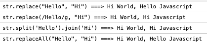
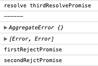
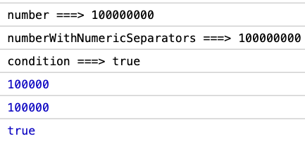

## ECMAScript 2021

- 해당 포스트는 2021년 5월 기준으로 3월 9일날 올라온 ES2021 후보자들에 대해서 기술합니다.

  - [ES2021 Release Candidate](https://github.com/tc39/ecma262/releases)

- tc39 finished-proposals의 리스트에서도 확인할수있습니다.
  - [finished-proposals](https://github.com/tc39/proposals/blob/master/finished-proposals.md)

<br>

### String.prototype.replaceAll

- [MD 문서](https://github.com/tc39/proposal-string-replaceall)

- 기존의 string prototype 함수중 replace 함수를 보완? 한 replace All 함수가 생겼습니다.

- 기존의 replace 함수는 문자열 or 정규 표현식을 사용하여 단일 or 모든 부분을 교체 하였습니다.

```javascript
const str = "Hello World, Hello Javascript";

const replaceStr = str.replace("Hello", "Hi");

console.log(`str.replace("Hello", "Hi") ===> ${replaceStr}`);

const replaceRegExpStr = str.replace(/Hello/g, "Hi");

console.log(`str.replace(/Hello/g, "Hi") ===> ${replaceRegExpStr}`);

정규 표현식을 쓰지 않고 문자열 로만 모든 부분을 교체 하기 위해서는 String#split 과 Array#join 을 이용하여야했다.

const replaceWithSplitJoinStr = str.split('Hello').join('Hi');

console.log(`str.split('Hello').join('Hi') ===> ${replaceWithSplitJoinStr}`);
```

- 이번에 ES2021 에서 추가된 replaceAll 을 사용하면 문자열 만으로도 모든 부분을 교체 할수 있게되었습니다.

```javascript
const replaceAllStr = str.replaceAll("Hello", "Hi");

console.log(`str.replaceAll("Hello", "Hi") ===> ${replaceStr}`);
```

- console 이미지
  

- Code [stackblitz](https://stackblitz.com/edit/replaceall?file=index.js)

<br>

### Promise.any + AggregateError

- [MD 문서](https://github.com/tc39/proposal-promise-any)

- Promise 배열 에서 1개 라도 resolve 되면 Promise.any 가 Resolve 된다.

- 1개의 Resolve 된 값만 리턴 된다.

- Promise 배열 에서 모든 Promise 가 Reject 되면 AggregateError 발생한다.

- 모든 Promise가 Reject 되면 AggregateError 에 모든 에러가 발생한다.

- Promise.race 와 차이점은 fulfils 되는 Promise 는 Promise 배열에서 resolve 된 값만 된다.
  - 자세한 차이점은 Promise Combinators 포스트를 작성하고 그곳에서 설명하겠습니다.

##### AggregateError

[MDN AggregateError](https://developer.mozilla.org/ko/docs/Web/JavaScript/Reference/Global_Objects/AggregateError)

- AggregateError 객체는 다수의 에러가 한 에러로 랩핑 되어야 할 때의 오류를 나타냅니다.
- 한 작업에서 여러개의 오류가 보고될 때 발생하는데, 대표적으로 Promise.any 에 전달된 promise들이 거부되었을 떄 발생합니다.

```javascript
const firstResolvePromise = new Promise((resolve, reject) => {
  setTimeout(() => resolve("firstResolvePromise"), 1000);
});

const secondResolvePromise = new Promise((resolve, reject) => {
  setTimeout(() => resolve("secondResolvePromise"), 900);
});

const thirdResolvePromise = new Promise((resolve, reject) => {
  setTimeout(() => resolve("thirdResolvePromise"), 800);
});

const firstRejectPromise = new Promise((resolve, reject) => {
  setTimeout(() => reject(new Error("firstRejectPromise")), 700);
});

const secondRejctPromise = new Promise((resolve, reject) => {
  setTimeout(() => reject(new Error("secondRejctPromise")), 600);
});

(async () => {
  try {
    const first = await Promise.any([
      firstResolvePromise,
      secondResolvePromise,
      thirdResolvePromise,
      firstRejectPromise,
    ]);

    console.log(`resolve ${first}`);
  } catch (e) {
    console.log(e);
  }
  // Promise 배열 안에 Reject 되는 게 있지만 가장 빨리 resolve 된 thirdResolvePromise 가 결과로 넘어온다.

  console.log("------");

  try {
    const first = await Promise.any([firstRejectPromise, secondRejctPromise]);

    console.log(`resolve ${first}`);
  } catch (e) {
    console.log(e);
    console.log(e.errors);
    e.errors.forEach((error) => console.log(error.message));
  }

  // 모든 Promise 가 Reject 가 되었을때 에러
})();
```

- console 이미지
  

- Code [stackblitz](https://stackblitz.com/edit/promise-any?file=index.js)

<br>

### WeakRefs && FinalizationRegistry

- [MD 문서](https://github.com/tc39/proposal-weakrefs)

- ES2021 에서는 객체의 참조에 관하여 도와주는 2가지 클래스가 추가되었습니다.

  - objects 에 관한 약한 참조를 만들어주는 WeakRefs class
  - 어떤 objects 가 가비지 콜렉티드 되면 콜백 함수를 실행해주는 FinalizationRegistry class

##### WeakRefs

- WeakRef 인스턴스는 등록한 객체가 메모리에 있으면 해당 객체를 반환하고, 가비지 콜렉티드 되었으면 undefined를 반환한다.
- 약한 참조의 주요 용도는 캐시 또는 대형 개체에 대한 매핑을 구현하는 것

```javascript
const obj = { key: "value" };
const weakRef = new WeakRef(obj);
// ...
weakRef.deref(); // obj or undefined
```

- **올바른 사용에는 신중한 생각이 필요하며 가능하면 피하는 편이 제일 좋다.**

- 아래는 MDN에 정의된 WeakRef 사용성에 대한 주의성을 알려주는 글 입니다.

```text
가비지 컬렉터 는 복잡합니다.
애플리케이션이나 라이브러리가 WeakRef를 정리하는 GC에 의존하거나시기 적절하고
예측 가능한 방식으로 종료 자 [정리 콜백]을 호출하는 경우 실망 할 수 있습니다.
정리가 예상보다 훨씬 늦게 발생하거나 전혀 발생하지 않을 수 있습니다. 변동성의 원인은 다음과 같습니다.

- 예를 들어 세대 별 수집으로 인해 동시에 도달 할 수없는 경우에도 한 개체가 다른 개체보다 훨씬 빨리 가비지 수집 될 수 있습니다.
- 가비지 수집 작업은 증분 및 동시 기술을 사용하여 시간이 지남에 따라 분할 될 수 있습니다.
- 다양한 런타임 휴리스틱을 사용하여 메모리 사용량과 응답 성의 균형을 맞출 수 있습니다.
- JavaScript 엔진은 도달 할 수없는 것처럼 보이는 것들에 대한 참조를 보유 할 수 있습니다 (예 : 클로저 또는 인라인 캐시).
- 다른 JavaScript 엔진은 이러한 작업을 다르게 수행하거나 동일한 엔진이 버전간에 알고리즘을 변경할 수 있습니다.
- 복잡한 요인으로 인해 특정 API와 함께 사용하는 것과 같이 예상치 못한 시간 동안 개체가 활성 상태로 유지 될 수 있습니다.
```

##### FinalizationRegistry

- FinalizationRegistry의 인스턴스는 등록된 객체가 가비지 콜렉티드 되면 콜백 함수를 실행한다

```javascript
const obj = { key: "value" };
const registry = new FinalizationRegistry((value) => {
  console.log(`${value} has been garbage collected`);
});
registry.register(obj, "registered object");
```

<br>

### Logical Assignment Operators

- [MD 문서](https://github.com/tc39/proposal-logical-assignment)
- javascript 세계에서는 많은 할당 연산자가 있다. 이번 ES2021 에서는 논리 할당 연산자가 추가되었다.
- 기존의 a = a + b 를 a +=b 로 처럼 할당 연산자를 하는것과 비슷하다.
- 바로 코드를 보면서 확인해 보자

```javascript
// before
a = a && b;
a = a || b;
a = a ?? b;

// after
a &&= b;
a ||= b;
a ??= b;
```

- tmi: Typescript 4.0 에서 추가된 기능 인데 이번에 Javascript 에도 추가가 되었다고 한다.

<br>

### Numeric separators

- [MD 문서](https://github.com/tc39/proposal-numeric-separator)
- 기존의 javascript 에서의 숫자는 단위 표시가 되지 않아서 딱 봤을때 얼마 인지 알아 보기가 어려웠다.
- Numeric separators MD 문서의 동기에서도 이렇게 표시한다.
  - 1000000000 // Is this a billion? a hundred millions? Ten millions?
- 그래서 이번에 ES2021 에서 숫자 사에에 \_를 추가할수있게 되어 단위 표시를 할수 있게 되었다.
- 꼭 3자리 단위 마다 _를 해야되는것이 아니라 숫자형인 어디에서나 _ 가 입력이 되었다.
  - 물론 협업을 할라면 상식적으로 표시 하는게 맞겠지

```javascript
const number = 100000000;
const numberWithNumericSeparators = 100_000_000;

console.log(`number ===> ${number}`);
console.log(`numberWithNumericSeparators ===> ${numberWithNumericSeparators}`);
console.log(`condition ===> ${number === numberWithNumericSeparators}`);

const test = 100000;
const testWithNumericSeparators = 10_00_00;
console.log(test);
console.log(testWithNumericSeparators);
console.log(test === testWithNumericSeparators);
```

- console 이미지
  

- Code [stackblitz](https://stackblitz.com/edit/numericseparators?file=index.js)
